

 

### *The Purest, Most Precise Digital Mushaf Experience & Quran Video Studio*

  
  
  
  

  
  
  
  
  

### *﴿ وَاذْكُرِ اسْمَ رَبِّكَ وَتَبَتَّلْ إِلَيْهِ تَبْتِيلًا ﴾*

 

**مصحفك كما تعرفه، وأثرٌ يصل أبعد.**

مصحف المدينة، والتلاوة، والتفسير، والحفظ، وصانع مقاطع قرآنية متزامنة — مجانًا وبدون إعلانات أو تتبع.

 

---

## 🌟 The Vision

<table>
<tr>
<td width="50%" valign="top">

### ⚠️ The Problem

Digital Quran apps typically force compromises across reading and sharing:

**📸 The "Scanned Image" Trap**
Static page scans → massive app size, slow loading, and blurry/pixelated text on high-res screens.

**📝 The "Generic Text" Trap**
Standard unformatted body text → destroys the sacred, standardized 15-line pagination of the authentic Madani Mushaf.

**🔇 The "Static Media" Trap**
Sharing is limited to plain text or flat cards → no way to create modern, synchronized Quran video reels for social platforms without third-party editors.

</td>
<td width="50%" valign="top">

### ✅ The Solution

**Tabattal brings an authentic Madani Mushaf and a native Quran video studio into one focused experience.**

- 📖 **Authentic Vector Engine:** Powered by King Fahd Complex **QCF V2 glyph fonts**, preserving the familiar 604-page, 15-line Madani Mushaf layout.
- 🎬 **Quran Video & Reels Studio:** Design and export synchronized videos in 9:16, 1:1, and 16:9 with recitations, line-by-line Madani typography, and custom image or video backgrounds.

> Read with focus. Understand with context. Share with care.

</td>
</tr>
</table>

 

---

## 📱 Showcase

<b>Arabic Showcase</b>

 

<table width="100%">
<tr>
    <td width="25%" align="center" valign="top">
        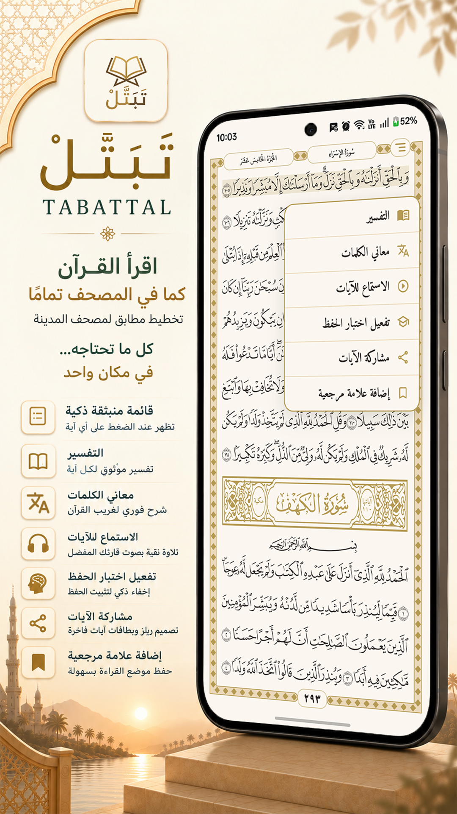
        
<b>📖 تلاوة القرآن والقائمة الذكية</b> رسم عثماني مطابق لمصحف المدينة وقائمة إجراءات سريعة

    </td>
    <td width="25%" align="center" valign="top">
        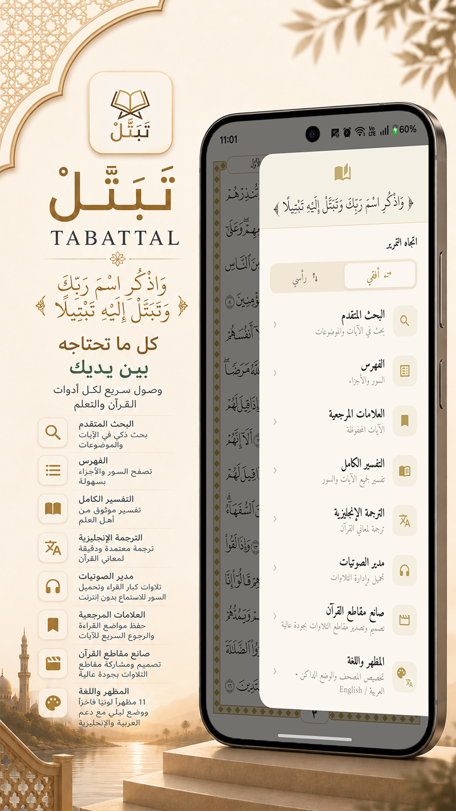
        
<b>📑 القائمة الجانبية والأدوات</b> تنقل فوري وشامل لجميع خدمات وأدوات المصحف

    </td>
    <td width="25%" align="center" valign="top">
        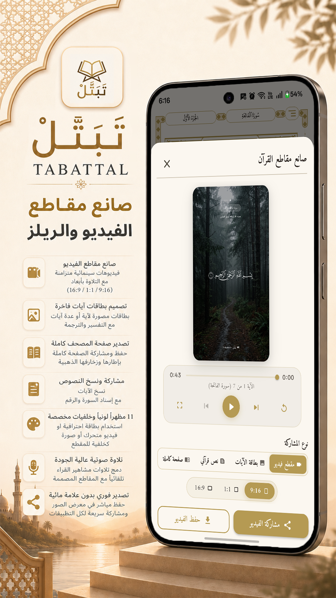
        
<b>🎬 صانع مقاطع الفيديو والريلز</b> فيديوهات قرآنية سينمائية متزامنة بدقة 1080p

    </td>
    <td width="25%" align="center" valign="top">
        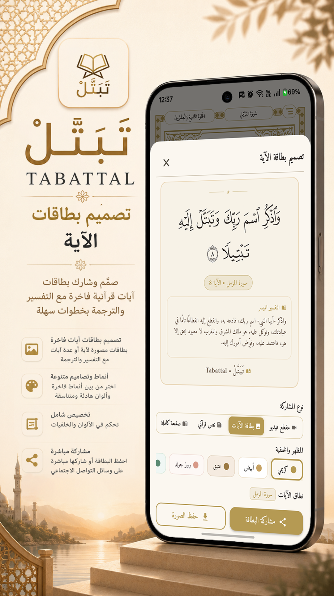
        
<b>🎨 تصميم بطاقات الآيات</b> بطاقات فاخرة للآيات مع التفسير والترجمة للمشاركة

    </td>
</tr>
<tr>
    <td width="25%" align="center" valign="top">
        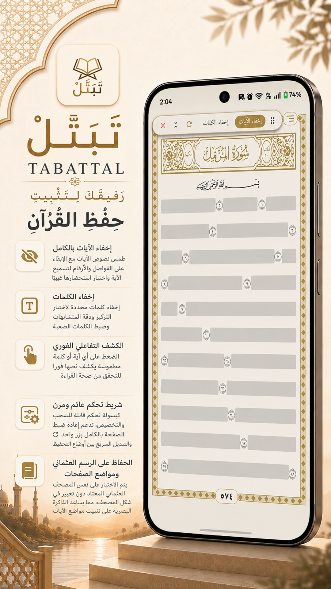
        
<b>🧠 وضع تثبيت واختبار الحفظ</b> إخفاء ذكي للآيات والكلمات وكشفها تفاعليًا بلمسة

    </td>
    <td width="25%" align="center" valign="top">
        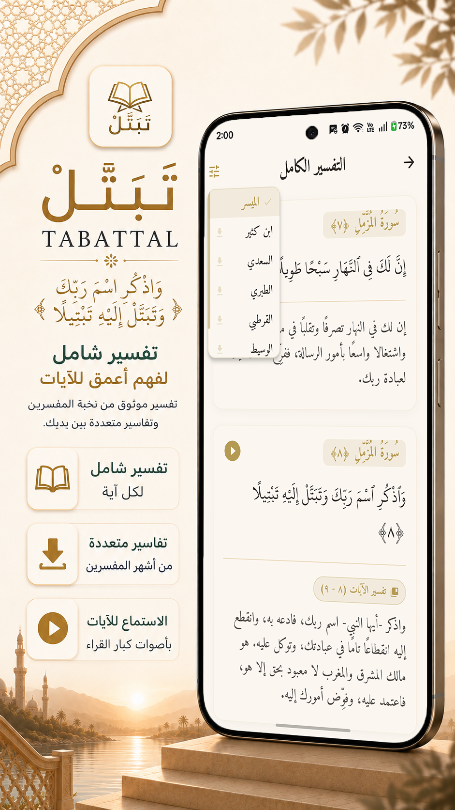
        
<b>📚 مكتبة التفسير الشاملة</b> تفسير كامل متصل مع تفاسير متعددة لأشهر العلماء

    </td>
    <td width="25%" align="center" valign="top">
        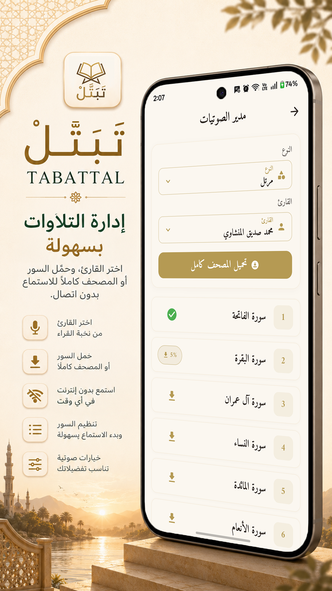
        
<b>🎧 مدير الصوتيات والتلاوات</b> تحميل السور والمصحف كاملًا بجودة نقية دون إنترنت

    </td>
    <td width="25%" align="center" valign="top">
        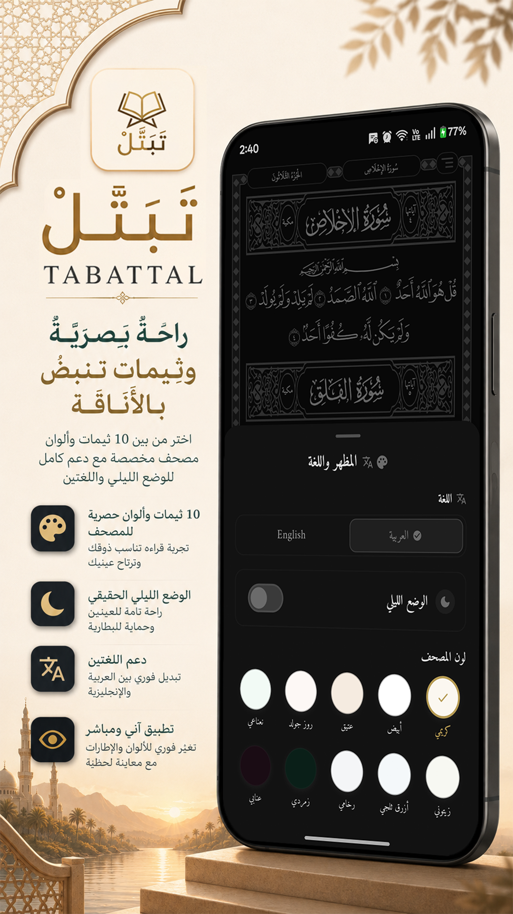
        
<b>🎨 المظهر واللغة وثيمات المصحف</b> 11 مظهرًا ووضع ليلي ودعم للغتين

    </td>
</tr>
</table>

<b>English Showcase</b>

 

<table width="100%">
<tr>
    <td width="25%" align="center" valign="top">
        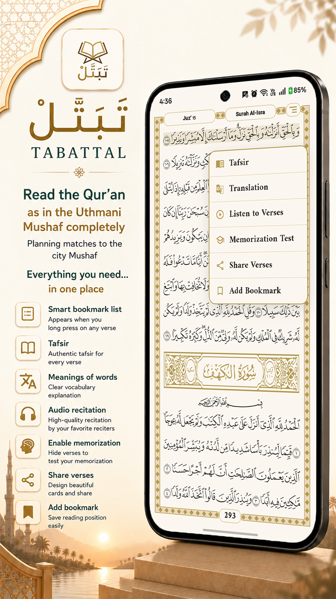
        
<b>📖 Authentic Mushaf & Smart Menu</b> Flawless 15-line Madani layout with quick actions

    </td>
    <td width="25%" align="center" valign="top">
        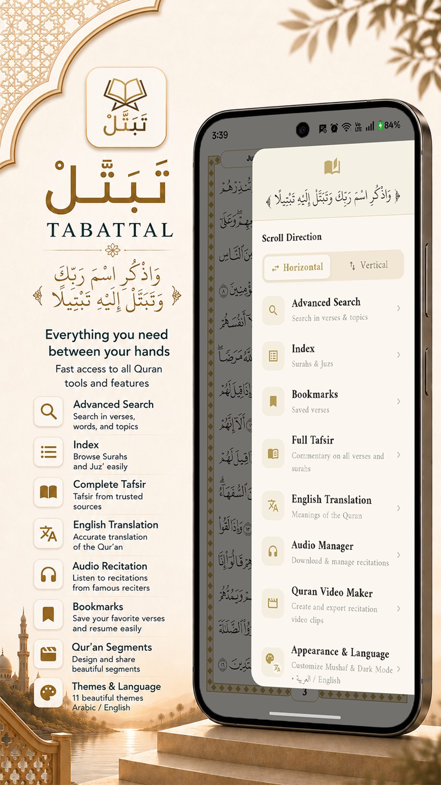
        
<b>📑 Navigation Drawer & Tools Hub</b> Instant access to all Quranic learning utilities

    </td>
    <td width="25%" align="center" valign="top">
        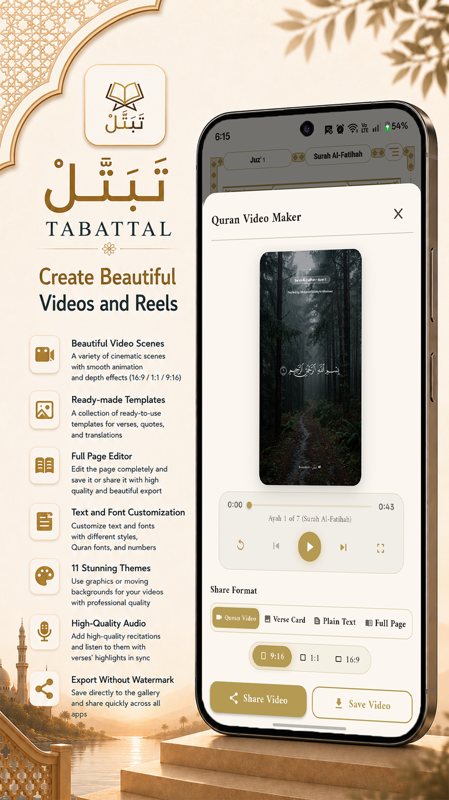
        
<b>🎬 Quran Video Studio & Reels</b> Synced audio video creator in 9:16, 1:1, and 16:9

    </td>
    <td width="25%" align="center" valign="top">
        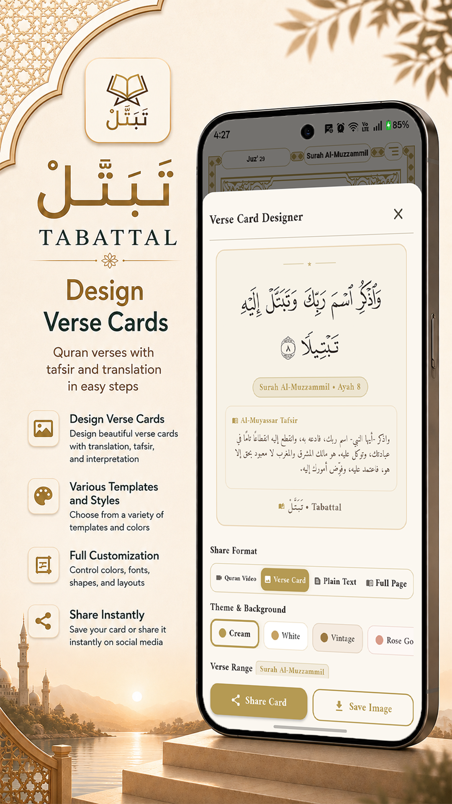
        
<b>🎨 Verse Card Designer & Sharing</b> High-res social cards with Tafsir & Translation

    </td>
</tr>
<tr>
    <td width="25%" align="center" valign="top">
        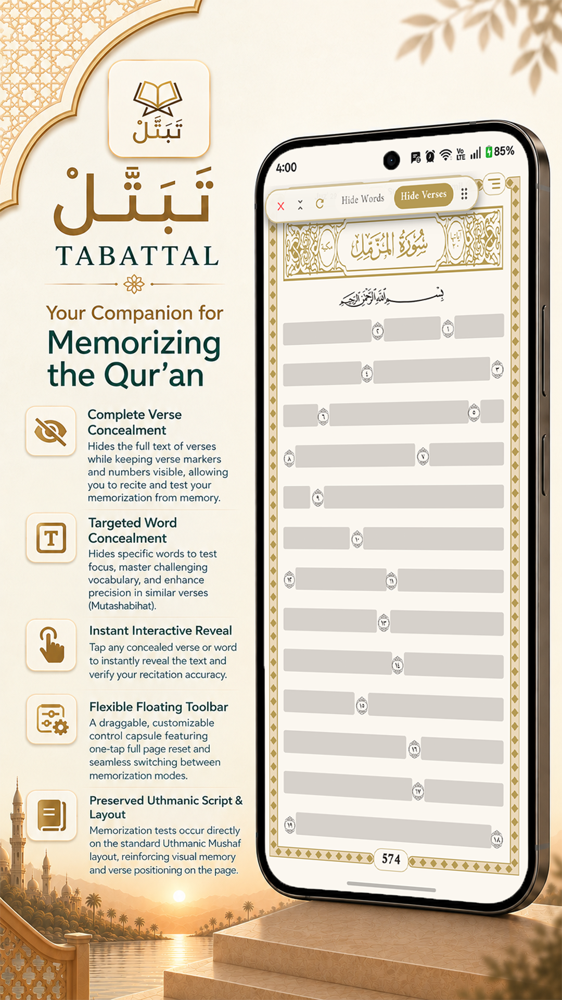
        
<b>🧠 Smart Hifz & Memorization Mode</b> Mask verses & words with tap-to-reveal testing

    </td>
    <td width="25%" align="center" valign="top">
        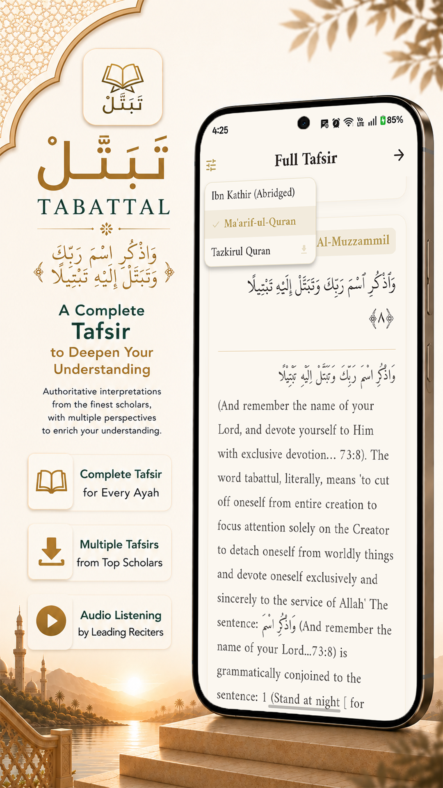
        
<b>📚 Comprehensive Tafsir Library</b> Full surah commentaries from leading scholars

    </td>
    <td width="25%" align="center" valign="top">
        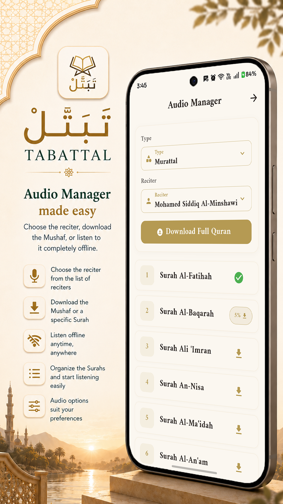
        
<b>🎧 Audio Manager & Offline Recitations</b> Download full surahs or entire Mushaf offline

    </td>
    <td width="25%" align="center" valign="top">
        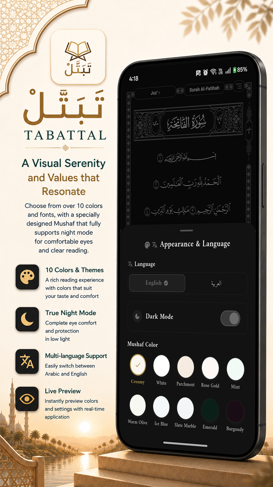
        
<b>🎨 Themes, Night Mode & Language</b> 11 themes, dark mode, and bilingual support

    </td>
</tr>
</table>

 

---

## ✨ Key Features

### 🖌️ Pixel-Perfect QCF V2 Vector Engine

<table>
<tr>
<td width="33%" valign="top">

**📐 Authentic Layout**

Exactly 15 lines per page, matching the physical printed Mushaf — genuine glyphs, genuine stop signs.

</td>
<td width="33%" valign="top">

**⚡ Responsive Paging**

Physics-driven bidirectional page navigation with adjacent-page prewarming for a responsive reading experience.

**🚀 Instant Typography**

All 604 page fonts pre-warmed in RAM — no zip extraction, no runtime layout overhead.

</td>
</tr>
</table>

 

### 🎬 Quran Video Studio & Reels Maker *(Creative Video Suite)*

<table>
<tr>
<td width="50%" valign="top">

**🎥 Multi-Aspect Studio Engine**
- **9:16 Vertical Story/Reels** — Tailored for Instagram Reels, TikTok & Shorts
- **1:1 Square Post** — Designed for WhatsApp Status, Feed & Posts
- **16:9 Landscape** — Built for YouTube & widescreen displays
- **Ayah Span Selector** — Choose a consecutive verse range with seamless continuity

</td>
<td width="50%" valign="top">

**✨ Authentic Typography & Dynamic Media**
- **Synchronized Recitation** — Precise EveryAyah audio sync with authentic line-by-line Madani vector typography
- **Dual Media Backgrounds** — Custom gallery images or **animated video backgrounds** (local or direct URL) with audio mixing
- **Adaptive Luminance Engine** — Auto-adjusts text colors (pure white / deep black) with adjustable dimming
- **Hardware-Accelerated FFmpeg Export** — Crisp, high-fidelity video rendering with instant gallery indexing

</td>
</tr>
</table>

 

### 🎨 Verse Card Generator & Page Export

- **Custom Sharing Cards** — High-resolution cards for single verses or verse ranges
- **Granular Controls** — Include/exclude Tafsir and English translation independently
- **Full-Page Snapshot** — Export the entire Mushaf page with Islamic border framing
- **11 Curated Themes** — Instant gallery sync with Android media store indexing

 

### 🔍 Thematic & Deep Text Search

- **Topics Catalog** — Aqeedah, Acts of Worship, Ethics, Stories of the Prophets, Social Conduct
- **Intelligent Engine** — Prefix/suffix normalization, surah matching, in-page highlighting with breathing animations

 

### 🎧 Comprehensive Audio & Offline Manager

<table>
<tr>
<td width="50%">

- 🎙️ **Extensive Reciters** — Murattal, Mujawwad, Warsh, Teacher mode, English translations
- ▶️ **Play-Once Mode** — Auto-pause after one verse for focused memorization
- ⏰ **Smart Sleep Timer** — Custom durations for bedtime listening

</td>
<td width="50%">

- 📥 **Offline Downloads** — Full Surahs with real-time progress & instant cancellation
- 🔔 **Background Service** — Lockscreen controls, notification actions, network recovery

</td>
</tr>
</table>

 

### 📚 Tafsir, Translation & Quran Vocabulary

- **Ghareeb Al-Quran** — Offline lookup for difficult Quranic words, per verse
- **Grouped Tafsir Context** — Smart detection of multi-verse commentary spans
- **Smart Selector** — Fast, offline commentaries with upward-opening picker
- **English Translation** — Clear, dignified text displayed alongside Arabic

 

### 🧠 Interactive Memorization Test (Hifz Tool)

- **Word & Ayah Masking** — Conceal text directly on the page with zero shifting
- **Tap-to-Reveal** — Instant reveal with full access to verse options

 

### 🎨 11 Handcrafted Themes & Adaptive UI

`Creamy` • `Parchment` • `Rose Gold` • `Mint` • `Olive` • `Ice Blue` • `Slate` • `Emerald` • `Burgundy` • `Pure White` • `OLED Dark`

- **OLED Dark Mode** — True black for Qiyam and night reading, saves battery
- **Adaptive Chrome** — Status/nav bar contrast adapts automatically to theme
- **Flexible Reading** — Switch between horizontal book paging and vertical scroll

 

### 🔒 100% Free, Private & Ad-Free

> Built as a **Sadaqa Jariya** — no ads, no tracking, no analytics, no third-party SDKs. Fully offline-first once content is downloaded.

 

---

## 🛠️ Technical Stack

| Layer | Technology |
|-------|-----------|
| **Framework** | Flutter (Android) |
| **State Management** | BLoC / Cubit |
| **Architecture** | Clean Architecture (Domain / Data / Presentation) |
| **Video & Motion Engine** | Custom Canvas Rasterizer + `ffmpeg_kit_flutter_new_min_gpl` |
| **Audio Pipeline** | `just_audio` + `audio_service` with MediaSession background sync |
| **Database & Cache** | SQLite (`sqflite`) with indexed word-level spatial lookup |
| **Typography** | 604 QCF V2 vector font families, natively managed |
| **Code Quality** | Strict zero-lint policy, optimized frame rendering |

 

---

## ☕ Support The Project

Tabattal is an **ad-free, open-source passion project** built as a Sadaqa Jariya to provide the purest Quran reading experience. If it benefits your daily recitation and study, consider supporting its development:

---

### ⭐ Star this repo to support the project

 

*Made with dedication to the Book of Allah* 🕌

